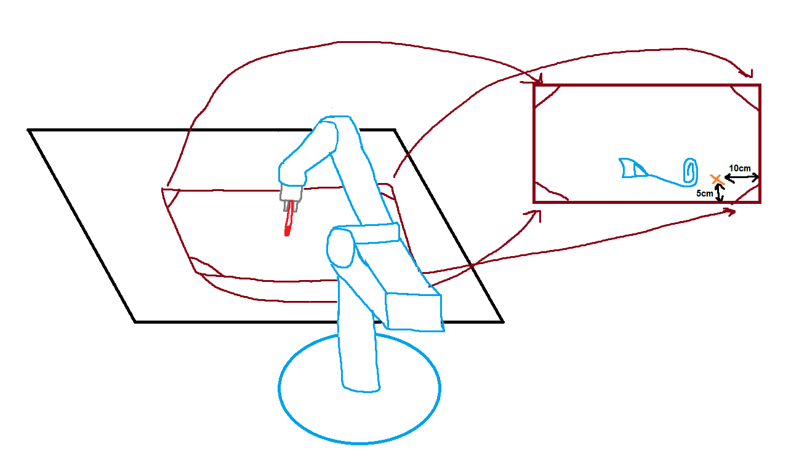

# Table of Contents

## Image Processing Functions

* distance
* get_mask2
* get_mask
* get_max_idx
* get_new_contours
* reduce_dim
* connected
* distance_end_to_beg
* get_mask_first
* is_start
* connec_cnt

## Robot Processing Functions

* read_and_wait
* calibrate_res
* Robot

# Points of Calibration of the Program

* In order to change the image we want to print is necessary to change the name in the function cv.imread in line 572
* In order to calibrate the number of points that our program outputs to the printing vector it is possible to change the threshold of the function get_mask2 in the line 653

# Starting Point of the drawing

