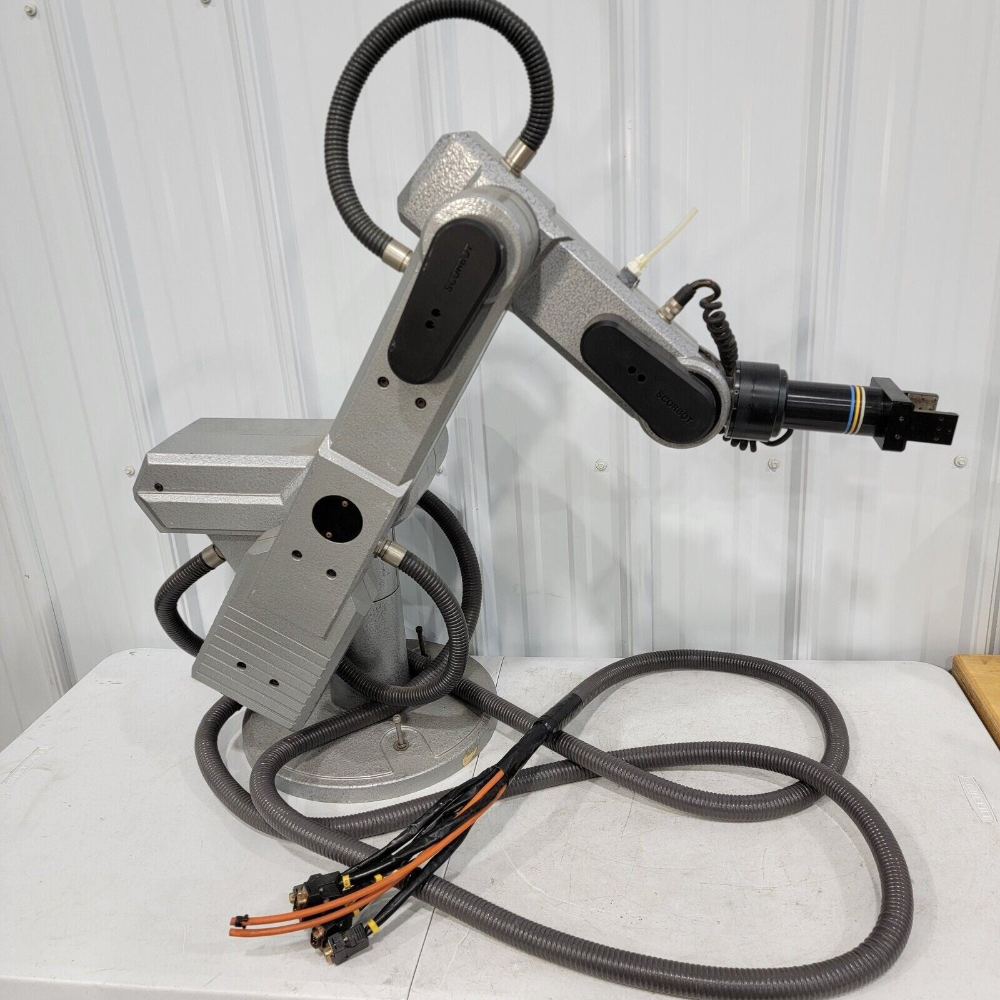
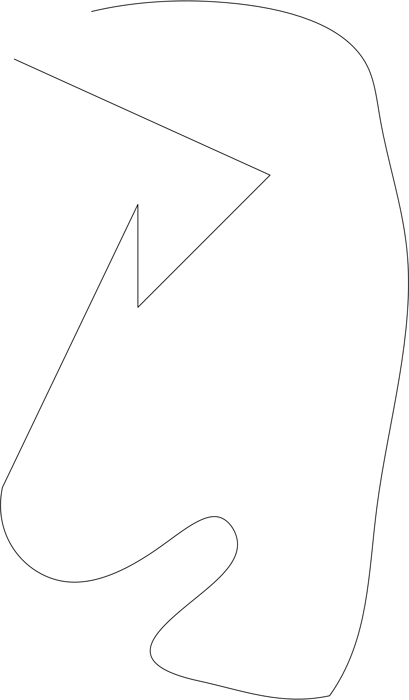
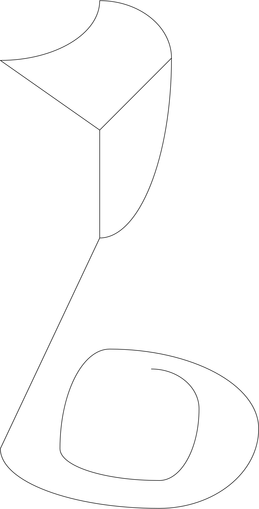
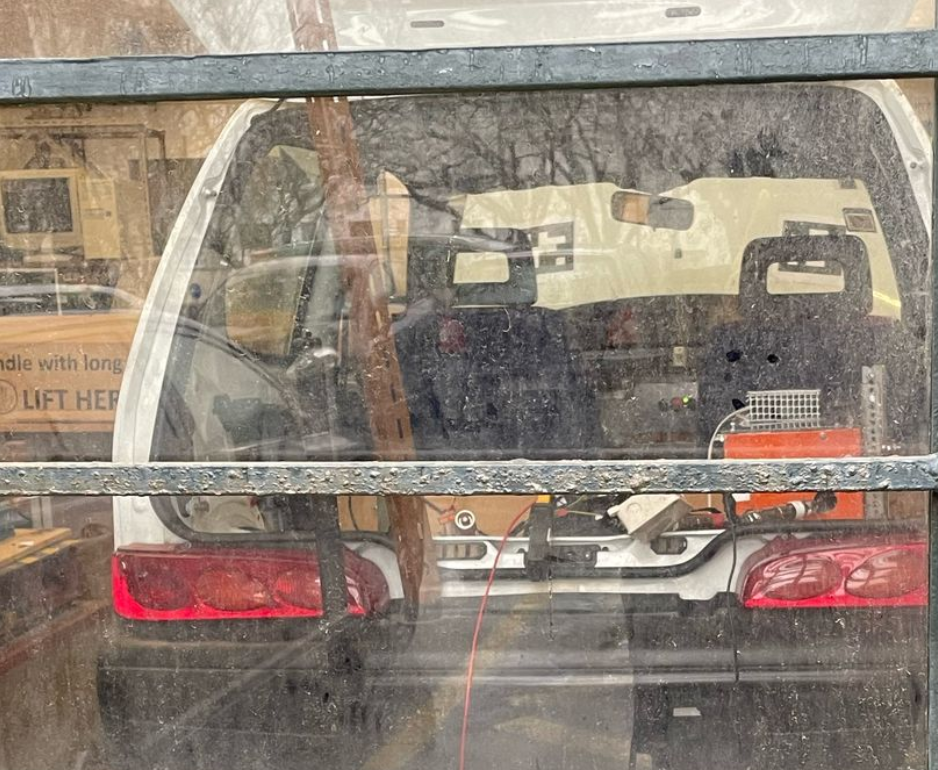

# Robotics Projects Repository

This repository contains two laboratory projects related to robotics. The first project focuses on controlling a **Scorbot ER VII** with image processing and forward kinematics (FK) control, while the second project involves controlling an **Ackermann steering model** for a **Fiat 500**.

## Projects

### 1. Scorbot ER VII Image Processing and FK Control

The **Scorbot ER VII** is a 6-DoF serial manipulator that communicates through ACL messaging via a serial port. This project designs an algorithm to execute the Scorbot's Forward Kinematics (FK) smoothly. 

It also involved image processing with **OpenCV** to identify contours and optimize the drawing path for images that cannot be drawn without lifting the pen. The manipulator had a pen attached to its tip to complete this task.

- **Code**: Found in `LAB1/VF.py`.
- **Introduction**: To understand how to use the Scorbot ER VII, refer to the documents:
  - `Scorbot_Intro.pdf`
  - `SCORBOT-ER-VII_intro.pptx.pdf`
  Located inside the `LAB1` folder.
- **Final Report**: The final report is available as `Robotics_Lab_1_PVF.pdf`.

### 2. Ackermann Model Control of a Fiat 500

This project simulates and controls the Ackermann steering model of a **Fiat 500**, focusing on steering geometry to replicate car-like turning behavior.

#### 2.1 Kinematics.py

This script models the vehicle's kinematics to follow a path using steering angle speed (`ws`) based on coordinates and GPS data.

- **Key Functions**:
  - `normalizeAngle(angle)`: Normalizes the steering angle.
  - `kinematic_model(path_x, path_y, GPS_x, GPS_y)`: Calculates steering angles and velocities.

- **Code Location**: Found in `LAB2/Kinematics.py`.

#### 2.2 Autonomous.py

Simulates the vehicle’s motion with feedback control to adjust its speed (`v`) and steering angle speed (`ws`) in real-time.

- **Key Components**:
  - **Car Class**: Simulates vehicle motion and control strategies for path following.
  - **Control**: The `controlled()` method adjusts errors in the vehicle's position.
  - **Path Following**: The `path_set()` method calculates necessary commands.
  - **State Update**: The `update()` method updates the vehicle’s state.

- **Main Workflow**:
  - The `main()` function simulates vehicle motion along a path and visualizes it with `matplotlib`.

- **Code Location**: Found in `LAB2/Autonomous.py`.

---

## Controller Data

### controller_real_path_data

This section focuses on real-world path data used by the Ackermann model to simulate the movement of the Fiat 500.

- **Path Data**: Trajectory data from sensors or GPS used to follow the path.
- **Control Signals**: Feedback loops adjust steering and velocity for accurate path following.
- **Challenges**: Real-world data is subject to noise, requiring filtering and robust control algorithms.

### controller_simulated_path_data

This section covers simulated path data used for testing in virtual environments.

- **Simulated Path**: Generated from predefined waypoints or models for validation.
- **Control Signals**: Calculated based on simulated vehicle position and path.
- **Testing & Validation**: Used for debugging control strategies before real-world deployment.

---

## Code Locations

- The **Scorbot ER VII Image Processing and FK Control** code is located in `LAB1/VF.py`.
- The **Ackermann Model Control of Fiat 500** code is located in `LAB2/Kinematics.py` and `LAB2/Autonomous.py`.

## Documentation

- **Scorbot ER VII Overview**: `Scorbot_Intro.pdf`, `SCORBOT-ER-VII_intro.pptx.pdf` inside the `LAB1` folder.
- **Project Report**: `Robotics_Lab_1_PVF.pdf` inside the `LAB1` folder.
- **LAB2 Report**: `Robotics_Lab_2` inside the `LAB2` folder.
